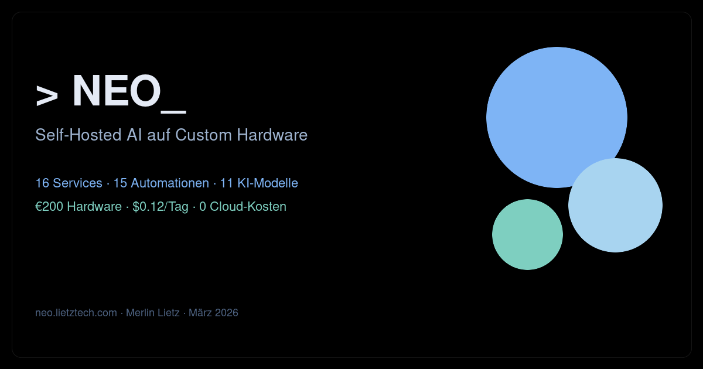

# NEO — Self-Hosted AI auf Custom Hardware

<p align="center">
  
</p>

> Ein KI-Agent. Ein MiniPC. Null Cloud. Gebaut von Merlin Lietz.

**[🌐 Live ansehen → neo.lietztech.com](https://neo.lietztech.com)**

---

## Was ist NEO?

NEO ist mein persönliches Homelab-Projekt: ein vollständig self-hosted KI-System auf einem €200-MiniPC.
Kein Cloud-Abo, kein Vendor Lock-in — alles läuft auf eigener Hardware.

Diese Website dokumentiert das Projekt als interaktives Showcase mit Live-Dashboard, Terminal-Demo und System-Statistiken in Echtzeit.

## Tech Stack

| Kategorie | Technologie |
|-----------|------------|
| **Frontend** | Astro v6, Tailwind CSS v4, Three.js, GSAP |
| **Hardware** | ACE Magic S (Intel N97, 16GB RAM) |
| **Virtualisierung** | Proxmox VE 9 |
| **Container** | Docker (8+ Services) |
| **Reverse Proxy** | Caddy + Cloudflare Tunnel |
| **KI** | LiteLLM, Ollama (11 Modelle) |
| **Automatisierung** | n8n, Cron, OpenClaw Agent |
| **DMS** | Paperless-ngx |
| **Benachrichtigungen** | Gotify, Telegram Bot |

## Features

- 🎨 **Cinematic 3D Background** — PBR-Orbs mit Fresnel-Shader (Three.js)
- 📊 **Live Dashboard** — CPU, RAM, Disk, Docker-Stats in Echtzeit
- 💻 **Terminal Demo** — Interaktiver Chat + 8 Bot-Szenarien
- 📱 **Telegram Preview** — Echte Bot-Konversation als Mockup
- 🤖 **AI Model Roster** — Alle 11 KI-Modelle mit Benchmarks
- ⚡ **Automation Timeline** — 14 Automatisierungen visualisiert
- 💰 **Cost Ticker** — Self-Hosted vs. Cloud Kostenvergleich
- 🎯 **Performance** — Three.js Code-Split, Mobile-Disable, IntersectionObserver

## Entwicklung

```bash
npm install    # Dependencies
npm run dev    # Dev-Server (localhost:4321)
npm run build  # Produktions-Build
```

## Deployment

Build via rsync auf Nginx-Server (LXC 113). Cloudflare Tunnel routet neo.lietztech.com.

```bash
npm run build
rsync -avz dist/ root@192.168.8.113:/var/www/neo-website/
```

## Lizenz

MIT © Merlin Lietz
